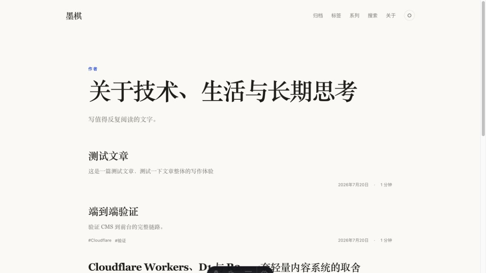
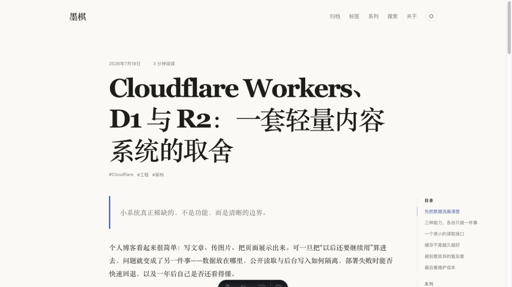
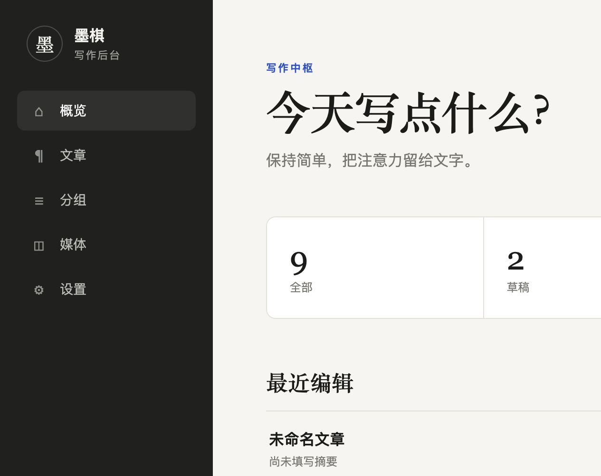
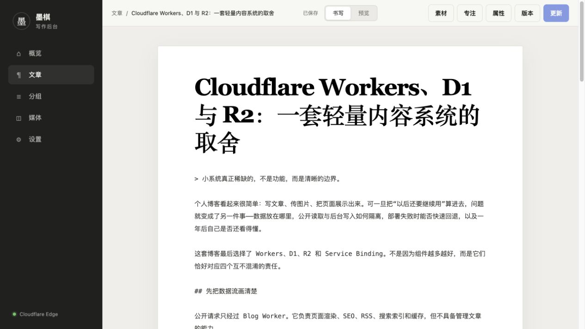
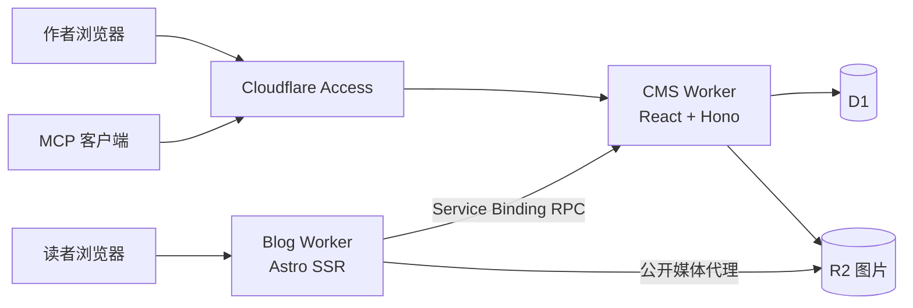

# cf-blog

一个为写作而生的 Cloudflare 原生个人博客。公开站点、写作后台与内容存储彼此分离；博客通过 Service Binding 读取内容，不向公开前台暴露管理 API。

> 项目处于首个可用版本，适合个人部署和二次开发。正式使用前请完成 Cloudflare Access 配置，并自行评估数据备份与升级策略。

## 界面预览

| 博客首页 | 文章详情 |
| --- | --- |
|  |  |

| 后台概览 | 文章编辑器 |
| --- | --- |
|  |  |

## 特性

### 博客前台

- Astro SSR，响应式纸张风格界面，支持浅色、深色与跟随系统主题
- 首页、文章详情、独立关于页、可选短文时间轴、归档、标签、系列与上一篇/下一篇导航
- 客户端搜索索引、RSS、Sitemap、Canonical URL 与基础 SEO 元数据
- 阅读时长、目录、封面、站点图标、限时草稿预览
- Markdown 内容经过服务端清理，原始 HTML 和任意 iframe 不会直接透传

### 写作后台

- React + Hono 管理后台，支持草稿、发布与归档状态
- 可选的独立短文管理页，支持纯文本、正文 `#标签`、图片、视频预览、草稿/发布、置顶、编辑与即时删除
- 草稿自动保存；已发布文章修改后需显式点击“更新”才会公开
- 专注写作、实时预览、版本快照、恢复历史与并发版本冲突提示
- 标签、系列分组与排序、站点导航、社交链接、主题色、短文介绍和 SEO 设置
- 批量发布、转为草稿、归档与删除；破坏性操作带确认或版本校验

### 媒体素材库

- 图片上传至 R2，元数据保存在 D1，可设置替代文本，并用于文章正文或短文附件
- 在线视频只保存标题与规范化外链，不下载、不上传到 R2
- 支持 YouTube、Bilibili、Vimeo，以及 HTTPS `.mp4` / `.webm` 直链
- 媒体库支持图片/视频筛选、搜索与预览；编辑器提供桌面侧栏和移动端抽屉
- 视频链接由服务端白名单解析并重建播放器地址，无法识别的地址安全降级

### 安全与自动化

- Cloudflare Access 保护后台；Worker 再次校验 Access JWT 的签名、issuer 与 AUD
- 浏览器写操作额外校验 Same-Origin
- Blog Worker 通过 RPC Service Binding 调用 CMS 内容服务
- 内置无状态 Streamable HTTP MCP，可供 Codex 等客户端搜索、读取和管理文章
- D1 保存文章、版本与短文，R2 只保存图片，媒体通过公开 Blog Worker 输出

## 架构



| 部分 | 技术 |
| --- | --- |
| 公开站点 | Astro、Cloudflare Workers |
| 管理后台 | React、React Router、Vite、Hono |
| 数据与媒体 | Cloudflare D1、R2 |
| 内容处理 | TypeScript、Zod、Unified / Remark / Rehype |
| 身份验证 | Cloudflare Access、JWT |
| 自动化接口 | MCP SDK、Cloudflare Agents |
| 工程化 | pnpm workspace、Vitest、Wrangler |

## 项目结构

```text
.
├── apps/
│   ├── blog/                 # Astro SSR 公开站点
│   └── cms/                  # React 管理界面与 Hono Worker
├── packages/
│   ├── contracts/            # 共享类型、Zod 契约、媒体 URL 规范化
│   └── markdown/             # Markdown 渲染、清理、摘要与阅读时长
├── migrations/               # D1 增量迁移
├── scripts/                  # 本地/远程演示数据脚本
└── docs/                     # Access 与 MCP 的专项配置文档
```

## 本地开发

### 环境要求

- Node.js `^20.19.0` 或 `>=22.12.0`
- pnpm `11.15.1`（仓库已通过 `packageManager` 固定）
- 本地开发不要求真实 Cloudflare 账号

### 启动

```bash
git clone <your-repository-url>
cd cf-blog
corepack enable
pnpm install
pnpm types
pnpm db:migrate:local
pnpm db:seed:demo:local # 可选，写入演示文章
pnpm dev
```

本地服务地址：

- 管理后台：<http://localhost:5173>
- CMS Worker：<http://localhost:8787>
- Blog：<http://localhost:4321>

Wrangler 会把本地 D1 和 R2 数据保存在 `apps/cms/.wrangler/state`，该目录不会提交到 Git。开发脚本只在 `ENVIRONMENT=development` 且请求来自 `localhost` 时启用本地身份；远程环境不会绕过 Access。

三个服务会由根目录的 `pnpm dev` 并行启动。也可以分别运行：

```bash
pnpm dev:cms
pnpm dev:admin
pnpm dev:blog
```

### 检查与测试

```bash
pnpm typecheck # TypeScript 与 Astro 检查
pnpm test      # 单元与回归测试
pnpm build     # CMS 与 Blog 生产构建
pnpm check     # 依次执行以上全部检查
```

测试覆盖共享契约、文章版本与状态变更、短文输入/附件/删除、MCP 工具、媒体操作、视频 URL 规范化、安全 Markdown 渲染和光标插入逻辑。

## 部署到 Cloudflare

### 1. 准备账号与配置

登录 Cloudflare：

```bash
pnpm exec wrangler login
```

在部署前检查并按需修改：

- `apps/cms/wrangler.jsonc` 中的 Worker、D1、R2 名称和环境变量
- `apps/blog/wrangler.jsonc` 中的 Worker 名称及指向 CMS 的 Service Binding
- 两个配置中的 Service Binding 服务名必须一致

CMS 环境变量：

| 变量 | 用途 | 示例 |
| --- | --- | --- |
| `ENVIRONMENT` | 运行环境；线上保持 `production` | `production` |
| `ACCESS_TEAM_DOMAIN` | Zero Trust team domain，含 `https://` | `https://team.cloudflareaccess.com` |
| `ACCESS_AUD` | CMS Access Application 的 Audience Tag | `your-audience-tag` |
| `BLOG_URL` | 公开博客根地址，用于生成预览链接 | `https://blog.example.com` |
| `MEDIA_BASE_URL` | 公开图片地址前缀 | `https://blog.example.com/media` |

这些配置值本身不是密码。Access Service Token 等敏感值不要写入 `wrangler.jsonc`、`.dev.vars` 示例、提交记录或日志；需要 Worker secret 时使用 `wrangler secret put`。

### 2. 准备 R2 与 D1

默认配置使用名为 `cf-blog-media` 的 R2 bucket。首次部署前创建它；如果修改了 `bucket_name`，命令也要使用相同名称：

```bash
pnpm exec wrangler r2 bucket create cf-blog-media
```

D1 binding 未保存账号专属 ID。当前 Wrangler 会在执行远程迁移时自动配置缺失的 D1 资源，然后按顺序应用 `migrations/`：

```bash
pnpm db:migrate:remote
```

如果团队不使用自动配置，也可以先手动创建 D1，再把 `database_id` 写入 CMS 的 Wrangler 配置。

### 3. 部署两个 Worker

```bash
pnpm check
pnpm db:migrate:remote
pnpm --filter @cf-blog/cms deploy
pnpm --filter @cf-blog/blog deploy
```

顺序很重要：先检查，再迁移数据库，再发布 CMS，最后发布依赖 CMS Service Binding 的 Blog。配置完成后可直接使用同等顺序的快捷命令：

```bash
pnpm deploy
```

升级已有站点时同样必须先执行远程迁移。本版本的短文表、附件关系、功能开关和公开页介绍分别由 `0005` 至 `0008` migration 增量创建；迁移不会因关闭短文功能而删除已有内容。

首次发布后：

1. 为 CMS 的 `workers.dev` 或自定义管理域名创建 Cloudflare Access Application。
2. 复制 team domain 与 AUD，回填 CMS 配置。
3. 将 `BLOG_URL` 和 `MEDIA_BASE_URL` 改为真实公开地址。
4. 运行 `pnpm types`，再次执行 `pnpm deploy`。
5. 验证无痕窗口先进入 Access 登录，而公开博客、RSS 和 `/media/*` 不会跳转到登录页。

完整步骤见 [Cloudflare Access 配置](docs/cloudflare-access.md)。Cloudflare 的 [Wrangler 配置文档](https://developers.cloudflare.com/workers/wrangler/configuration/) 与 [D1 migration 文档](https://developers.cloudflare.com/d1/reference/migrations/) 可用于确认资源和迁移行为。

### 4. 正式域名与收口

建议使用两个域名：

- `blog.example.com` → Blog Worker
- `admin.example.com` → CMS Worker，并由 Access 保护

正式域名验证完成后，可将两个 `wrangler.jsonc` 的 `workers_dev` 与 `preview_urls` 改为 `false`，避免继续暴露临时地址。修改绑定、变量或兼容性日期后运行 `pnpm types`，让生成的 Worker 类型与配置保持一致。

## MCP 接入

CMS Worker 在 `/mcp` 提供文章管理工具，并复用同一套 Access 鉴权、D1 服务和版本冲突控制。建议为自动化客户端创建独立的 Cloudflare Access Service Token；不要复用浏览器身份或将 Token 提交到仓库。

配置示例、工具边界与凭证轮换见 [Codex MCP 接入与运维](docs/codex-mcp.md)。

日常写作、媒体管理、分组、站点设置与本地调试流程见 [后端（CMS）功能使用指南](docs/backend-usage.md)。

## 常用命令

| 命令 | 作用 |
| --- | --- |
| `pnpm dev` | 并行启动 CMS Worker、管理界面和 Blog |
| `pnpm types` | 根据 Wrangler 配置生成 Worker 类型 |
| `pnpm db:migrate:local` | 应用本地 D1 migration |
| `pnpm db:migrate:remote` | 应用远程 D1 migration |
| `pnpm db:seed:demo:local` | 幂等写入本地演示文章 |
| `pnpm db:seed:demo` | 幂等写入远程演示文章 |
| `pnpm check` | 类型检查、测试与生产构建 |
| `pnpm deploy` | 检查、迁移、部署 CMS、部署 Blog |

## 参与贡献

欢迎提交问题和改进。开始前请阅读 [CONTRIBUTING.md](CONTRIBUTING.md)；安全问题请按 [SECURITY.md](SECURITY.md) 私下报告。

## License

[MIT](LICENSE)
